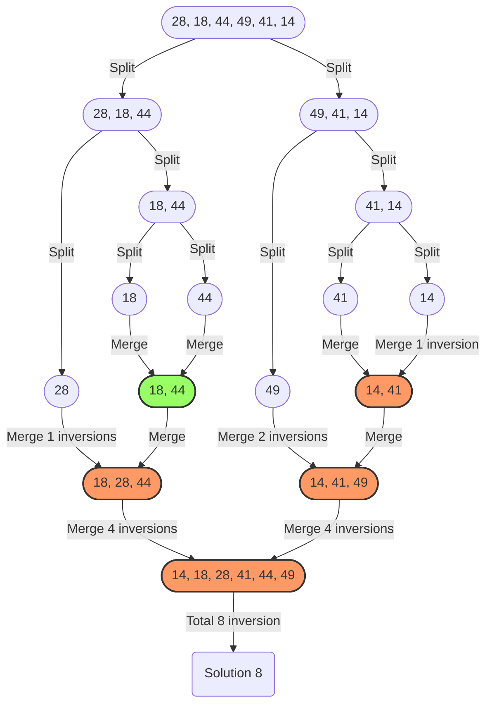

## Q2: Inversion Count in an Array

### Problem Description

Given an array of integers **A**. If \(i < j\) and \(A[i] > A[j]\), then the pair \((i, j)\) is called an inversion of A. Find the total number of inversions of A modulo \(10^9 + 7\).

---

### Problem Constraints

- \(1 \leq \text{length of the array} \leq 10^5\)
- \(1 \leq A[i] \leq 10^9\)

---

### Input Format

The only argument given is the integer array A.

---

### Output Format

Return the number of inversions of A modulo \(10^9 + 7\).

---

### Example Input

- Input 1:
  ```
  A = [1, 3, 2]
  ```
- Input 2:
  ```
  A = [3, 4, 1, 2]
  ```

---

### Example Output

- Output 1:
  ```
  1
  ```
- Output 2:
  ```
  4
  ```

---

### Example Explanation

- Explanation 1:
  ```
  The pair (1, 2) is an inversion as 1 < 2 and A[1] > A[2].
  ```
- Explanation 2:
  ```
  The pair (0, 2) is an inversion as 0 < 2 and A[0] > A[2].
  The pair (0, 3) is an inversion as 0 < 3 and A[0] > A[3].
  The pair (1, 2) is an inversion as 1 < 2 and A[1] > A[2].
  The pair (1, 3) is an inversion as 1 < 3 and A[1] > A[3].
  ```


### Visual Explanation: Solution


