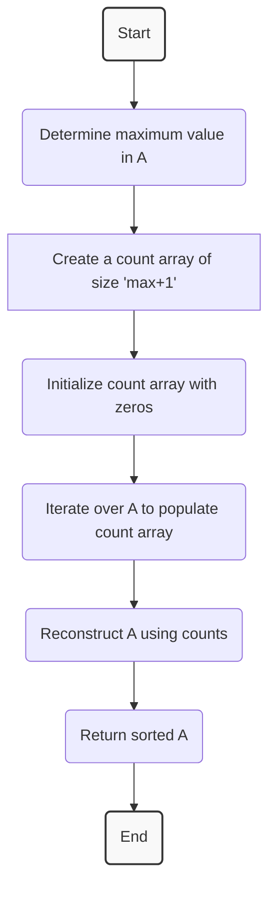

### Q3: Count Sort

#### Problem Description

Given an array **A**. Sort this array using Count Sort Algorithm and return the sorted array.

#### Problem Constraints
- 1 <= length of array A <= 100,000
- 1 <= A[i] <= 100,000


#### Input Format

The first argument is an integer array A.

#### Output Format

Return an integer array that is the sorted array A.

#### Example Input

- Input 1:
  ```
  A = [1, 3, 1]
  ```
- Input 2:
  ```
  A = [4, 2, 1, 3]
  ```

#### Example Output

- Output 1:
  ```
  [1, 1, 3]
  ```
- Output 2:
  ```
  [1, 2, 3, 4]
  ```

#### Example Explanation

- For Input 1:
  ```
  The array in sorted order is [1, 1, 3].
  ```
- For Input 2:
  ```
  The array in sorted order is [1, 2, 3, 4].
  ```

#### Visual Explanation: Solution Using Count Sort



### Steps of Count Sort

1. **Identify the Maximum Value**: Determine the largest element in the input array to decide the size of the counting array.
2. **Create and Initialize Count Array**: Create an array where the index represents the elements from the original array, and initialize all positions to 0.
3. **Store Counts**: Iterate over the input array, incrementing the corresponding index in the count array.
4. **Reconstruct the Array**: Construct the sorted output by iterating through the count array and adding elements to the output array according to the stored counts.
5. **Complete and Return**: Return the sorted array.
